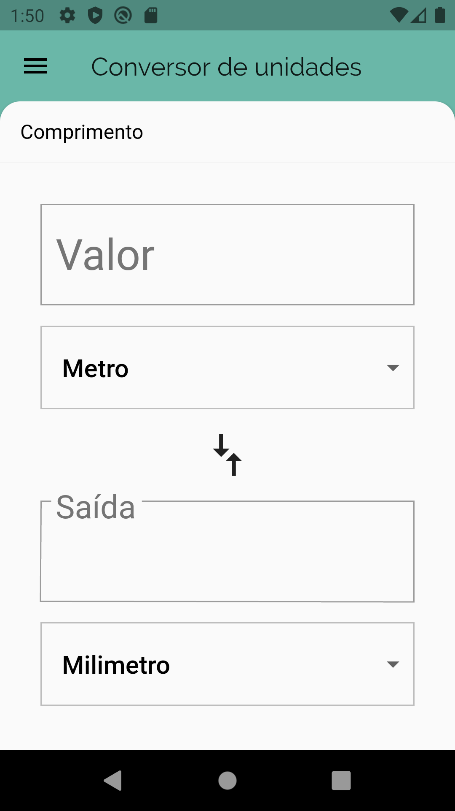
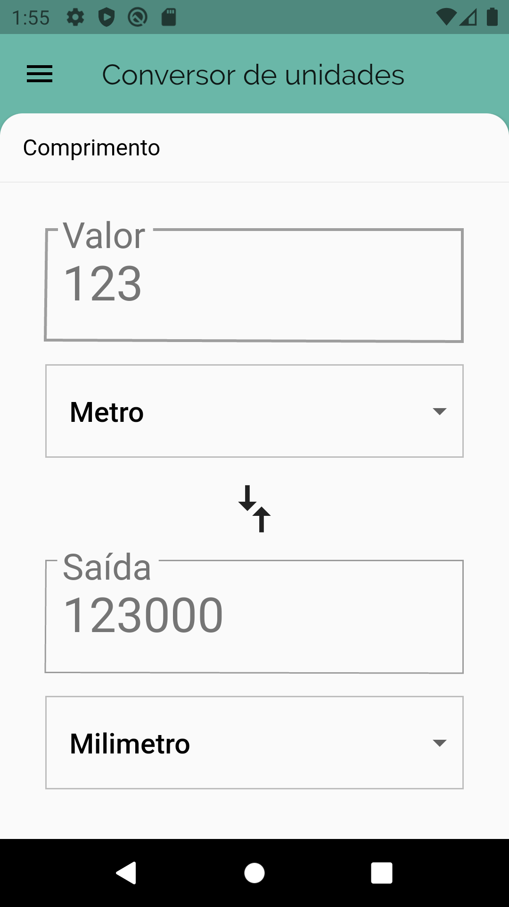
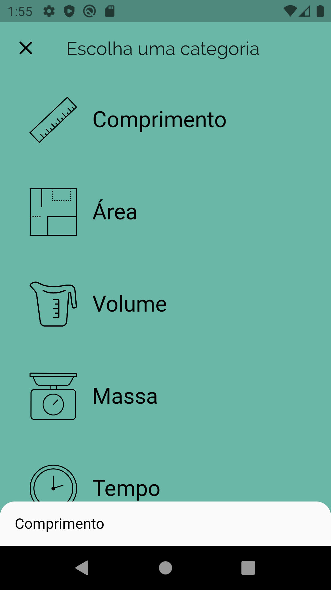
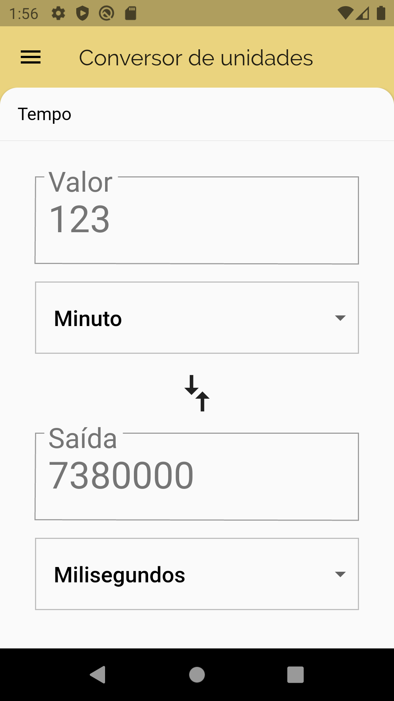
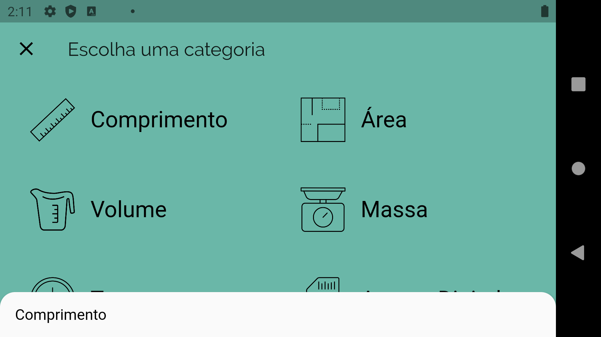

# Conversor de unidades

Um projeto de estudos sobre Flutter, mas que funciona! 

Converta unidades de vários tipos: 

- Conversor de unidades de comprimento;
- Conversor de unidades de área;
- Conversor de unidades de volume;
- Conversor de unidades de massa;
- Conversor de unidades de tempo;
- Conversor de unidades de armazenamento digital;
- Conversor de unidades de energia;

## Screenshots

